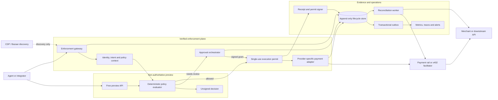

# IntentFence payment-firewall architecture

Status: target architecture accepted for implementation; production readiness is
blocked on the open dependencies and review gates below.

This document distinguishes the current declared-input service from the target
payment firewall. It is an architecture contract, not a claim that every target
component is implemented.

## Scope and requirements

The first commercial system protects real payment attempts made by autonomous
agents. It is deliberately narrower than a general-purpose "trust protocol."

### Functional requirements

- Keep a free, unsigned policy preview for integration and policy testing.
- Put the verified path in the actual payment execution path; an SDK hint alone
  is not enforcement.
- Evaluate authenticated subject, payment intent, amount, counterparty, policy
  version, and approval requirements immediately before execution.
- Route exceptions to a real approver and accept only a signed, expiring grant.
- Mint a single-use execution permit for an allowed payment attempt.
- Execute through provider adapters without receiving a payer seed phrase or
  wallet private key.
- Bind decision, approval, service-fee settlement, downstream payment outcome,
  and signed receipt with stable correlation identifiers.
- Reconcile recorded state against provider or on-chain facts and surface
  mismatches to an operator.
- Treat discovery systems as distribution dependencies, not runtime trust
  anchors.

### Current state versus target state

| Capability | Current state | Target state |
| --- | --- | --- |
| Free preview | Unsigned declared-input decision | Remains non-authoritative and cannot mint a permit |
| Paid x402 path | Proves service-fee settlement and signs the declared-input decision | Authenticated, policy-bound decision that may mint a one-time execution permit |
| Human approval | Caller can declare an approval proof | Signed grant from an identified approver, bound to one intent and expiry |
| Enforcement | Integrator is instructed to block downstream execution | Trusted adapter consumes the permit atomically before executing the payment |
| Audit | Best-effort payment-audit insert after a successful response | Durable lifecycle events plus transactional outbox before success is exposed |
| Reconciliation | No continuous reconciler | Worker compares decisions, grants, settlements, and downstream outcomes |
| Discovery | Static manifests and Bazaar metadata | Same, with credentialed publication isolated from the enforcement plane |

## High-level architecture

### Execution contract

1. The caller submits an idempotency key and authenticated payment intent.
2. The gateway resolves an immutable policy version and records `received`.
3. The evaluator returns `denied`, `review_pending`, or `allowed`.
4. A review path pauses until a signed grant is approved, denied, or expires.
5. An allowed path mints a short-lived permit containing the intent hash,
   policy version, subject, adapter, nonce, audience, and expiry.
6. The trusted adapter atomically consumes that permit before submitting the
   payment. Replays and mismatched parameters fail closed.
7. Lifecycle events are persisted before success is returned. A signed receipt
   references the same identifiers but is evidence, not the execution authority.
8. Reconciliation verifies settlement and downstream outcome asynchronously.

The synchronous path handles evaluation and ordinary execution. Human approval,
telemetry export, and reconciliation are asynchronous so they do not hold a web
request open.

## Component boundaries

- **Enforcement gateway:** validates identity, idempotency, intent shape, policy
  version, and adapter eligibility. It is the only entry point that can request
  an executable permit.
- **Policy evaluator:** pure deterministic logic shared with preview. It has no
  payment credentials and cannot execute an action.
- **Approval orchestrator:** owns approval identity, expiry, revocation, and the
  signed grant. A caller-provided string is never sufficient proof.
- **Permit signer/consumer:** issues audience-restricted, single-use permits and
  records consumption atomically.
- **Payment adapters:** translate the canonical intent into CDP, Crossmint,
  x402, card, or other provider operations. Each adapter has least-privilege
  credentials and explicit capability declarations.
- **Lifecycle store/outbox:** authoritative record of state transitions and
  reliable source for telemetry and reconciliation work.
- **Reconciler:** detects missing, duplicate, late, or contradictory facts and
  drives bounded retries or operator review.

Start as a modular monolith with one durable relational store and an outbox.
These are logical boundaries, not a mandate for premature microservices.

## Initial non-functional requirements

These are design targets to benchmark before publishing an SLA.

| Category | Initial target |
| --- | --- |
| Security | Verified execution fails closed. Preview output is cryptographically and structurally incapable of authorizing a payment. No wallet private keys or reusable payment signatures are logged or stored. |
| Integrity | One idempotency key maps to one canonical intent. One permit can be consumed at most once. Policy and intent hashes are immutable after evaluation. |
| Performance | Free preview p95 <= 250 ms; internal verified evaluation and signing p95 <= 500 ms, excluding human wait and external settlement latency. |
| Availability | 99.9% monthly target for the enforcement plane before a production SLA. An outage blocks autonomous payment; a manual break-glass process remains outside the agent path. |
| Durability | RPO 0 for issued permits and observed settlements; RTO <= 4 hours. State transition and outbox publication are atomic. |
| Reconciliation | p95 reconciliation lag <= 5 minutes; unreconciled settled payments alert within 5 minutes. |
| Privacy | Store normalized metadata and hashes, not secrets or unrestricted prompts. Minimum supported audit retention is 30 days and must be policy-configurable. |
| Scale | Initial capacity target is 25 sustained and 100 burst payment attempts per second; stateless request handling permits horizontal scaling when measured demand requires it. |
| Cost | Internal variable infrastructure cost should remain <= 20% of paid per-attempt revenue, excluding payment-rail and network fees. |
| Maintainability | Provider adapters pass a shared conformance suite. Policy and event schemas are versioned and backward-readable. |

## Observability and reconciliation

Every lifecycle event carries `request_id`, `intent_id`, `policy_version`, and
`correlation_id`; applicable events also carry `approval_id`, `permit_id`,
`provider_payment_id`, and `downstream_action_id`.

Minimum events are:

`received`, `evaluated`, `approval_requested`, `approval_granted`,
`approval_denied`, `approval_expired`, `permit_issued`, `permit_consumed`,
`payment_submitted`, `payment_settled`, `payment_failed`, `action_completed`,
`action_failed`, and `reconciliation_mismatch`.

Required metrics include decision counts by status and policy, approval latency,
permit replay attempts, provider latency/error rate, settlement-to-action lag,
unreconciled item age, receipt-signing failures, and cost per guarded attempt.
Trace attributes must be bounded and redacted. Raw authorization headers,
wallet signatures, private keys, full prompts, and unrestricted payment payloads
must never be telemetry attributes.

## Failure modes

| Failure | Required behavior |
| --- | --- |
| Identity, policy store, or signer unavailable | Return a retryable error before minting a permit or requesting settlement; do not execute. |
| Approval forged, replayed, revoked, or expired | Reject it; grants are signed, intent-bound, audience-bound, and single-use. |
| Duplicate request or client retry | Return the prior state for the same idempotency key; reject a changed intent under that key. |
| Provider timeout before known submission | Retry only with provider idempotency; otherwise mark `unknown` for reconciliation. |
| Settlement succeeds but response is lost | Recover by provider/on-chain identifier and return the existing receipt; never charge or execute twice. |
| Permit issued but payment is not submitted | Expire the permit and record a dangling-permit metric; no automatic recreation without policy re-evaluation. |
| Payment settles but downstream outcome is absent | Quarantine as a reconciliation mismatch and alert; compensation is provider-specific and never assumed safe. |
| Lifecycle store or outbox unavailable | Do not expose successful verified execution. Preview may remain available independently. |
| Chain reorganization or settlement reversal | Keep the action pending until the configured finality rule; reopen reconciliation on reversal. |
| Bazaar unavailable or stale | Direct runtime endpoints continue; discovery status is degraded and alerted separately. |
| CDP credential missing, expired, or under-scoped | Disable that adapter/publication path and fail its readiness check; never fall back to a more privileged credential. |

## Trade-offs

- **Provider-neutral enforcement over wallet-native-only rules:** increases
  adapter and conformance work, but creates the cross-rail commercial wedge.
- **Trusted adapter over advisory SDK wrapper:** reduces bypass risk, but requires
  integration in the customer's actual execution path.
- **Durable event state over logs alone:** adds storage and operations, but is
  necessary to explain and reconcile money movement.
- **Fail closed over maximum availability:** can delay legitimate payments, but
  prevents unreviewed autonomous spend. Manual break-glass is explicit and
  separately audited.
- **Modular monolith over microservices:** minimizes initial operational cost;
  component boundaries allow later extraction based on measured bottlenecks.

## Open dependency: CDP and Bazaar credentials

The repository does not establish ownership, secret values, scopes, rotation,
or a production smoke test for any credentialed Coinbase Developer Platform
(CDP) or Bazaar publication/settlement path. The precise credential contract
must be confirmed with the chosen provider before that path is enabled.

Until resolved:

- CDP adapters and credentialed Bazaar release/sync are **not production-ready**.
- Credentials must be provisioned through the runtime secret store, never the
  repository, and scoped independently for discovery and payment operations.
- Readiness must verify account ownership, required scopes, destination wallet,
  network, rotation owner, and a sandbox-to-production promotion procedure.
- Existing direct endpoints and the PayAI facilitator path must not be described
  as CDP-backed merely because Bazaar metadata is present.
- Discovery failure must not weaken enforcement or silently switch providers.

## Review gates

Before production implementation is declared complete, the owner and first
design partner must approve:

- the first provider adapter and exact action boundary;
- approval identity and notification channel;
- settlement finality and compensation rules;
- audit retention and data residency;
- CDP/Bazaar account ownership and credential scopes;
- measured NFR results and the manual break-glass procedure.

## Decision records

- [ADR-0001: Focus on a provider-neutral payment firewall](adr/0001-payment-firewall-wedge.md)
- [ADR-0002: Separate free preview from verified enforcement](adr/0002-preview-versus-verified-enforcement.md)
- [ADR-0003: Use lifecycle events and continuous reconciliation](adr/0003-observability-and-reconciliation.md)

Related contracts: [protocol](../PROTOCOL.md), [security model](../SECURITY.md),
and [pilot definition](../PILOT.md).
